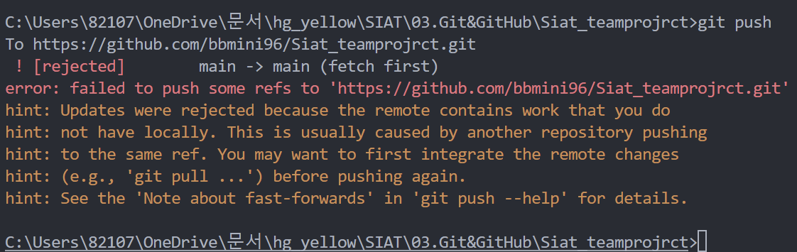
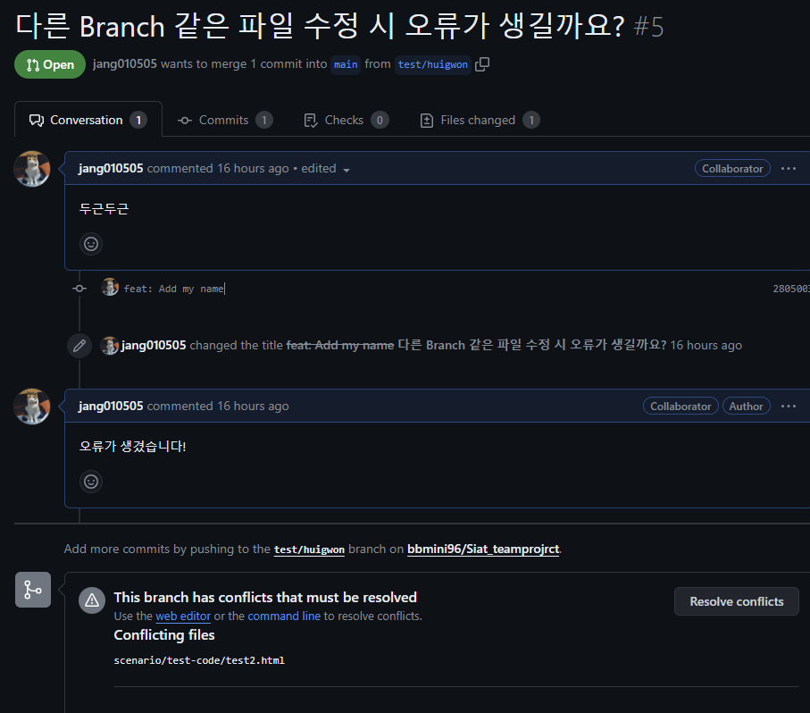
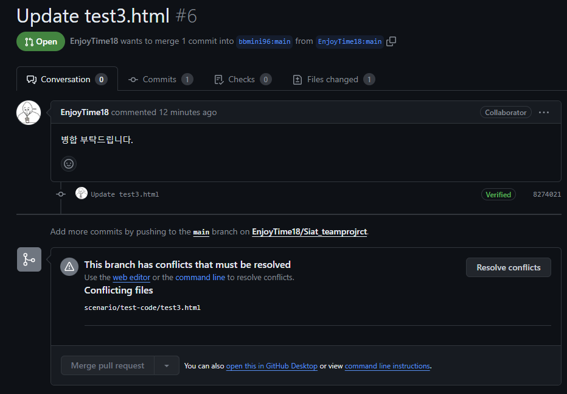

### Git & Github 충돌 시나리오
Git과 Github를 사용하면서 발생할 수 있는 충돌 시나리오를 작성한 곳 입니다. \
많은 시나리오가 있겠지만 작은 예시 3개만 작성하였습니다.
  
#### 1. 같은 branch에서 같은 파일을 수정하는 경우
 - 희: test1.html을 수정 후 commit & push
 - 성: git pull을 하지 않고 test1.html을 수정 후 commit & push
    - Error? 
      - 
      - 에러 발생
  
    - Why?
      - 같은 브렌치에서 같은 파일을 수정할거면 git pull을 매번 해줘야함

    - Soltion
      - 그냥 같은 파일을 안 건드리면 됨
      - 뭐.. git pull하고 개발 시간이 다르면 뭐,,, 

  
#### 2. 다른 Branch에서 같은 파일을 수정하는 경우
 - 창: test/changmin branch 생성 후 checkout
 - 희: test/huigwon branch 생성 후 checkout
 - 창: test2.html을 수정 후 commit & push
 - 창: main <- test/changmin merge
 - 희: git pull을 안 한 상태에서 test2.html을 수정 후 commit & push
 - 희: main <- test/huigwon merge
    - Error?
      - 
      - 에러 발생

    - Why?
      - 아무리 다른 브렌치여도 같은 파일을 수정하면 오류가 발생함
  
   - Solution
     -  관리자가 판단하여 smart하게 merge하면 돰

  
#### 3. Fork를 뜬 Repository에서 파일을 수정한 경우
 - 성: Siat_teamprojrct를 개인 Repository에 Fork
 - 창: test3.html 수정 후 commit & push
 - 성: git pull을 안 한 상태에서 test3.html을 수정 후 commit & push
 - 성: 창민님이 Oner인 Siat_teamprojrct에 PR
 - 창: PR 수락
    - Error?
      - 
      - 에러 발생
  
    - Why?
      - 2번과 같은 상황이라 보면 됩니다!
      - 결국엔 Fork 떠온 Repo는 다른 Branch라 생각해도 되는 부분이기에 비슷한 상황입니다!!
  
    - Solution
      - 이하동문 2번 참고!